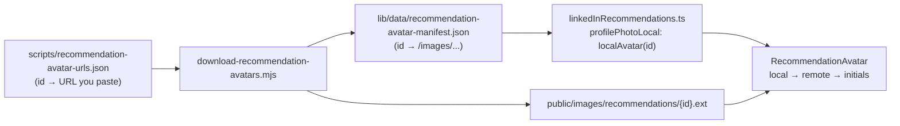

# Recommendation profile images (LinkedIn avatars)

## Why this exists

LinkedIn serves profile photos from `media.licdn.com` using **signed URLs**. They include an expiry (`e=` in the query string). After they expire, the same URL returns errors such as `403 deny-expired-url`, so **hotlinking those URLs in the site breaks over time**.

This repo keeps **stable copies** of the images under `public/images/recommendations/` and points the app at them via a small manifest. You only need to **paste fresh image URLs** when you refresh assets (no scraping, no LinkedIn login in automation).

## How it fits together

1. **`scripts/recommendation-avatar-urls.json`**  
   Maps each testimonial **`id`** (`"1"` … `"10"`, matching `linkedInRecommendations`) to a **full HTTPS URL**. You edit this file when links break. Use an **empty string** to skip an id for that run.

2. **`scripts/download-recommendation-avatars.mjs`**  
   For each non-empty URL, performs a plain **`fetch` (GET)** with redirects, reads the response body, detects image type from **magic bytes** (JPEG, PNG, GIF, WebP), and writes:
   - `public/images/recommendations/{id}.{ext}`

3. **`lib/data/recommendation-avatar-manifest.json`**  
   Updated by the script. Maps each id to a **public path** the Next.js app can use, e.g. `"/images/recommendations/3.jpg"`. Existing entries are **merged** with new downloads so a partial run does not wipe prior successful paths.

4. **`lib/data/linkedInRecommendations.ts`**  
   Imports the manifest and sets **`profilePhotoLocal: localAvatar("1")`** (etc.) so each recommendation knows its local path when the manifest has an entry.

5. **`RecommendationAvatar`** (testimonial cards and modal)  
   Tries **`profilePhotoLocal`** first, then the original **`profilePhoto`** URL, then **initials** if both fail.

## Getting fresh LinkedIn image URLs

Automation does not log into LinkedIn. When an image breaks:

1. Open the relevant LinkedIn profile or recommendation context in a browser (while logged in if needed).
2. Open DevTools → **Network**, filter by **Img**, reload or find the profile image request.
3. Copy the **`media.licdn.com`** request URL and paste it into `scripts/recommendation-avatar-urls.json` for the matching **`id`**.

Commit the updated JSON, then run the download (locally or via GitHub Actions).

## Commands

| Command | Purpose |
|--------|---------|
| `npm run avatars:sync-urls` | Copies each **`profilePhoto`** from `lib/data/linkedInRecommendations.ts` into `scripts/recommendation-avatar-urls.json` (no network). Run this after you update image URLs in the TS file. |
| `npm run avatars:download` | Downloads images from the JSON file and updates the manifest. |

Requirements: **Node 18+** (uses global `fetch` for downloads).

## Exit code

- **`0`**: At least one image downloaded successfully, or nothing failed (e.g. empty skips only).
- **`1`**: Every non-skipped download failed (e.g. all URLs expired or network error), or an uncaught exception.

## GitHub Actions

Workflow: **`.github/workflows/download-recommendation-avatars.yml`**

- Trigger: **Actions → Download recommendation avatars → Run workflow** (`workflow_dispatch` only).
- Checks out the repo, runs Node, executes the same script, then **commits and pushes** changes under:
  - `public/images/recommendations/`
  - `lib/data/recommendation-avatar-manifest.json`

Ensure **Actions** is allowed to push to the default branch if you use branch protection (may need an exception for `github-actions[bot]`).

## What you commit

- **`scripts/recommendation-avatar-urls.json`**: your list of source URLs (update when links expire).
- **`public/images/recommendations/*`**: binary image files produced by the script.
- **`lib/data/recommendation-avatar-manifest.json`**: generated path map (do not hand-edit unless you know what you are doing).

## Security and scope

- The script only **GETs URLs you list**. It does not scrape LinkedIn pages or use credentials.
- Do not commit secrets into the JSON file; image URLs are public CDN links.
